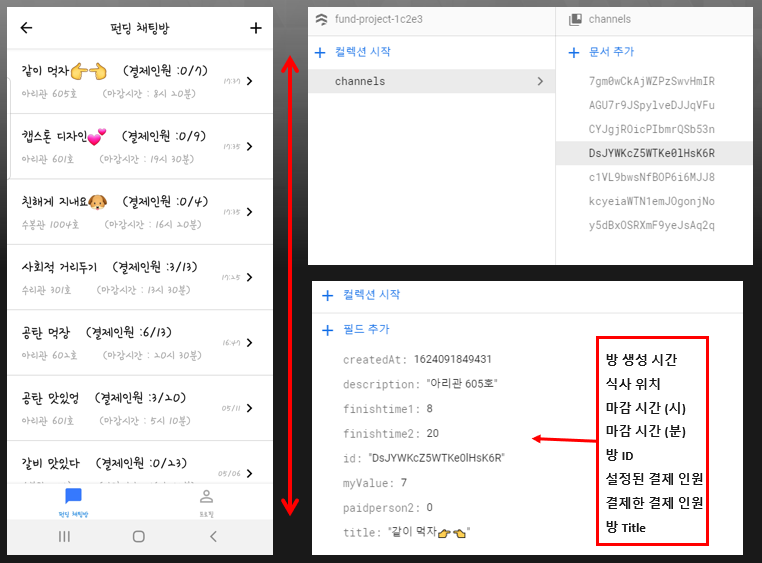
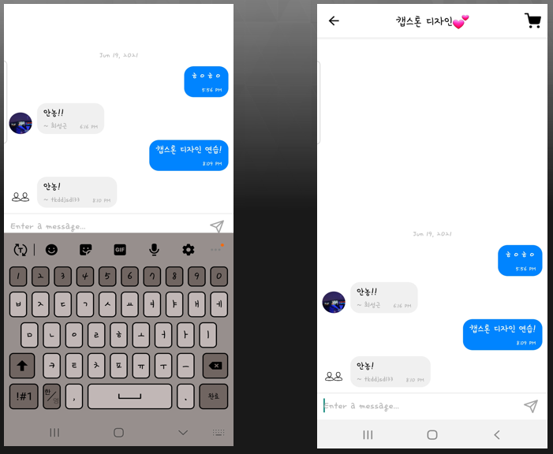
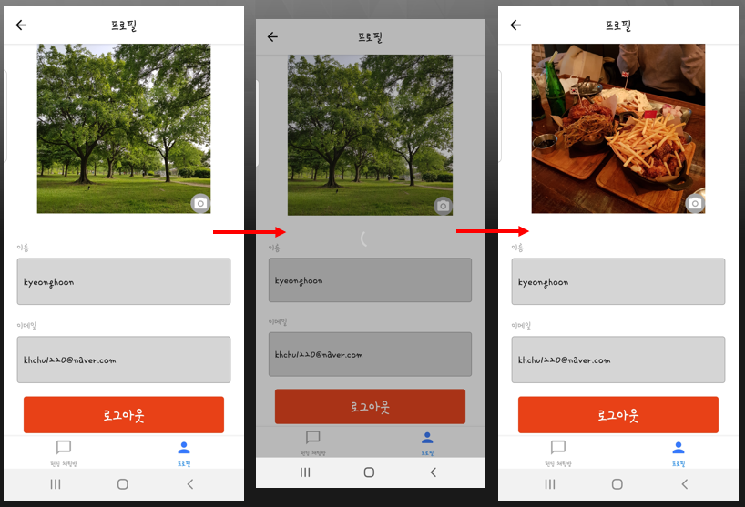

# funding-delivery
RN expo 개발 연습(펀딩 시스템을 도입한 배달)
<br>
<br>
**1. P1 로그인**


```
useEffect(() => {
        setDisabled(!(email && password && !errorMessage));
      }, [email, password, errorMessage]);

const _handleEmailChange = email => {
    const changedEmail = removeWhitespace(email);
    setEmail(changedEmail);
    setErrorMessage(
        validateEmail(changedEmail) ? '' : '이메일을 확인하세요.'
    );
};
const _handlePasswordChange = password => {
    setPassword(removeWhitespace(password));
};
```
- _handleEmailChange 이메일 Input 값 속에 onChangeText로 들어간다.
- 이메일을 대입하는 것에 공백을 제거하고 이메일 양식과 맞지 않을 경우
- 이메일을 확인하라는 에러메세지를 출력한다.
- 이러한 방식으로 pw 모듈도 만들었고 알맞는 정보를 입력시에 로그인 한다.
<br>


```
  const _handleSigninBtnPress = async () => {
    try {
      spinner.start();
      const user = await signin({ email, password });
      setUser(user);
    } catch (e) {
      Alert.alert('로그인 오류', e.message);
    } finally {
      spinner.stop();
    }
  };
  ```
  - 로그인 버튼 onPress 값에 들어가는 모듈이다.
  - 로그인 버튼을 눌렀을 경우 옳바른 정보시에 로그인이 되고
  - 알맞지 않았을 경우 로그인 오류 에러메세지를 출력한다.
  <br>
  
  
  ```
  <Button
          title="아이디/비밀번호를 모르겠어요!"
          onPress={() => navigation.navigate('IdPw')}
          containerStyle={{ marginTop: 0, backgroundColor: 'transparent' }}
          textStyle={{ color: theme.btnTextLink, fontSize: 12 }}
        />
  ```
  - 비밀번호 찾기 기능은 버튼만 만들어 놓고 따로 네비게이션을 구성하지는 않았다.
  <br>
  
  
  **2. P2 회원가입**
  
  
  
  
  
  ```
  useEffect(() => {
        setDisabled(
            !(name && email && password && passwordConfirm && !errorMessage)
        );
    }, [email, name, passwordConfirm, password, errorMessage]);
  
  useEffect(() => {
        if (refDidMount.current) {
            let error = '';
            if (!name) {
                error = '이름을 입력하세요.';
            } else if (!email) {
                error = '이메일을 입력하세요.';
            } else if (!validateEmail(email)) {
                error = '이메일을 확인하세요.';
            } else if (password.length < 6) {
                error = '비밀번호는 최소 6자리 이상이여야합니다.';
            } else if (password !== passwordConfirm) {
                error = '비밀번호가 일치하지 않습니다.';
            } else {
                error = '';
            }
            setErrorMessage(error);
        } else {
            refDidMount.current = true;
        }
    }, [email, name, passwordConfirm, password]);
  ```
  - 이름을 입력하지 않았을 때 ‘이름을 입력하세요.’ 에러메세지 출력
  - 이메일 양식과 맞지 않을 경우 ‘이메일을 확인하세요’ 에러메세지 출력
  - 이메일을 입력하지 않았을 때 ‘이메일을 확인하세요' 에러메세지 출력
  - 비밀번호를 6자리 미만으로 입력했을 때 ‘비밀번호는 최소 6자리 이상이여야합니다.’ 에러메세지 출력
  - 비밀번호가 일치하지 않을 때, ‘비밀번호가 일치하지 않습니다.’ 에러메세지 출력
  <br>
  
  
  ```
  <Button title="회원가입" onPress={_handleSignupBtnPress} disabled={disabled} />
  ```
  - useEffect 를 사용해 name && email && password && password Confirm이 입력되지 않았을 때 버튼 비활성화
  - KeyboardAwareScrollView를 통해 텍스트 입력 시에 입력창이 같이 올라가게 구현
  <br>

  
  
  이 외에 기능
  - 프로필 사진 설정 가능
  - 회원가입 버튼 클릭시 Firebase에 데이터 전송
  - 스택 네비게이션을 통해 회원가입 시에 메인 화면으로 이동
<br>
  


  
  **3. P3 펀딩채팅방리스트**
  
  
  
  - <ScrollView> 라이브러리를 통해 화면 스크롤 가능하게끔 구현
  - 데이터 베이스에서 값 가져와 채널의 방의 이름, 결제인원, 식사 장소, 마감 시간, 방 생성 시간을 리스트에 보여줌
    <br>    
        
    
  ```
  const getDateOrTime = ts => {
    const now = moment().startOf('day');
    const target = moment(ts).startOf('day');
    return moment(ts).format(now.diff(target, 'day') > 0 ? 'MM/DD' : 'HH:mm');
}
  ```
  - getDateorTime을 통해 방 생성 날짜가 당일이 아닐경우 시간 대신 날짜를 보여줌
<br>
        
        
  ```
        useEffect(() => {
        const unsubscribe = DB.collection('channels').orderBy('createdAt', 'desc').onSnapshot(snapshot => {
            const list = [];
            snapshot.forEach(doc => {
                list.push(doc.data())
            });
            setChannels(list);
        });
        return () => unsubscribe();
    }, [])
  ```
  - Unsubscirbe를 통해 채팅방의 생성 시간 순서대로 나열
<br>
        
        
  ```
        <FlatList
                data = {channels}
                renderItem = {({ item }) => <Item item = {item} onPress = {params => navigation.navigate('Channel', params)} />}
                keyExtractor = {item => item['id'].toString()}
                windowSize = {5}
        />
  ```
  ```
  var Item = React.memo(
    ({item: {id, title, description, createdAt, myValue, paidperson2, finishtime1, finishtime2}, onPress}) => {
        console.log(id);
        return (
            <ItemContainer onPress = {() => onPress({ id, title})}>
                <ItemTextContainer>
                    <ItemTitle>{title}   (결제인원 :
                        {paidperson2}/{myValue})</ItemTitle>
                    <ItemDesc>{description}      (마감시간 : {finishtime1}시 {finishtime2}분)</ItemDesc>
                </ItemTextContainer>
            <ItemTime>{getDateOrTime(createdAt)}</ItemTime>
            <ItemIcon />
        </ItemContainer>
        );
    }
);
  ```
  - 플랫리스트를 통해 채팅방마다의 값을 전달해 각각의 고유의 채팅방을 설정
  - 탭 네비게이션을 통해 프로필 버튼을 누르면 프로필로 이동
  - 추가 버튼을 누르면 채팅 방 만들기 컴포넌트로 넘김
  - Navigation.replace를 통해 뒤로가기 버튼을 누르면 전 페이지로 이동
                
 
        
**4. P4 펀딩채팅방**
                
                

                
                
- 데이터 베이스에서 값 가져와 채널의 방의 이름을 설정한다.
- Gifted chat 기능을 사용해 채팅 방 구현, 채널의 저장된 message 필드 값을 firebase에서 받아온다.
- 채팅 입력 버튼 _handleMessageSend를 사용해 message를 messageList[]에 채널 Id, message를 저장한다.
- Unsubscribe를 통해 DB channels 컬렉션에 저장된 채널의 Id document 가져온다. 또한 메시지를 출력하는데 순서는 createdAt 데이터 값(메시지 입력 시간) 순서로한다. 
- 스택 네비게이션을 통해 장바구니 버튼을 누르면 장바구니 결제 페이지로 넘어간다.
- Navigation.replace를 통해 뒤로가기 버튼을 누르면 전페이지로 이동한다.
<br>
                
   
**5. P5 프로필**
                
                

                
              
- Spinner을 사용해 변경 로딩 중 로딩 마크가 들어가도록 만듬
<br>
                
                
```
                const _handlePhotoChange = async url => {
        try {
            spinner.start();
            const photoURL = await updateUserInfo(url);
            setPhoto(photoURL);
        } catch (e) {
            Alert.alert('Photo Error', e.message);
        } finally {
            spinner.stop();
        }
    };
```
- _handlePhotoChange를 통해 프로필 사진 변경 버튼을 활성화 시킴
- Firebase updateUserInfo를 통해 사진의 URL을 uploadImage의 사진으로 변경 
- 스택 네비게이션을 통해 로그아웃 버튼을 누르면 로그아웃이 실행되고 Singin 페이지로 이동(버그로 인한 수정 예정)
- 추가 버튼을 누르면 채팅 방 만들기 컴포넌트로 이동
- Navigation.replace를 통해 뒤로가기 버튼을 누르면 전페이지로 이동

  
  
  
  
  
  
  

