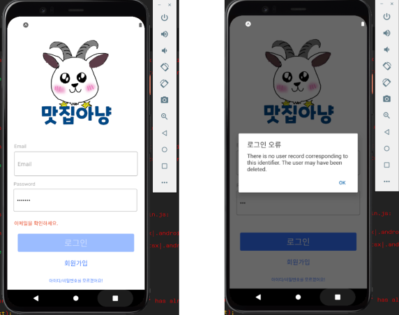
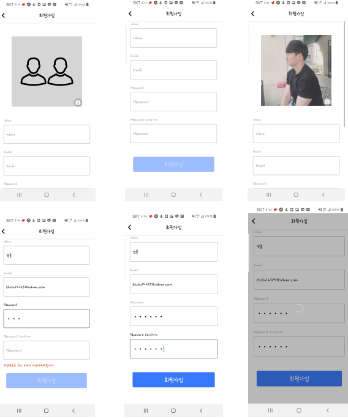
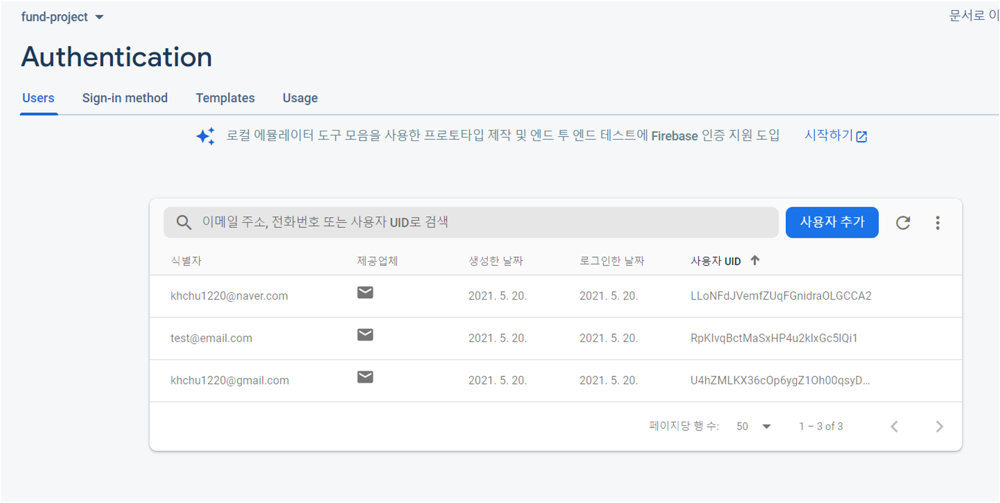

# funding-delivery
RN expo 개발 연습(펀딩 시스템을 도입한 배달)
<br>
<br>
**1. P1 로그인**





```
useEffect(() => {
        setDisabled(!(email && password && !errorMessage));
      }, [email, password, errorMessage]);

const _handleEmailChange = email => {
    const changedEmail = removeWhitespace(email);
    setEmail(changedEmail);
    setErrorMessage(
        validateEmail(changedEmail) ? '' : '이메일을 확인하세요.'
    );
};
const _handlePasswordChange = password => {
    setPassword(removeWhitespace(password));
};
```
- _handleEmailChange 이메일 Input 값 속에 onChangeText로 들어간다.
- 이메일을 대입하는 것에 공백을 제거하고 이메일 양식과 맞지 않을 경우
- 이메일을 확인하라는 에러메세지를 출력한다.
- 이러한 방식으로 pw 모듈도 만들었고 알맞는 정보를 입력시에 로그인 한다.
<br>


```
  const _handleSigninBtnPress = async () => {
    try {
      spinner.start();
      const user = await signin({ email, password });
      setUser(user);
    } catch (e) {
      Alert.alert('로그인 오류', e.message);
    } finally {
      spinner.stop();
    }
  };
  ```
  - 로그인 버튼 onPress 값에 들어가는 모듈이다.
  - 로그인 버튼을 눌렀을 경우 옳바른 정보시에 로그인이 되고
  - 알맞지 않았을 경우 로그인 오류 에러메세지를 출력한다.
  <br>
  
  
  ```
  <Button
          title="아이디/비밀번호를 모르겠어요!"
          onPress={() => navigation.navigate('IdPw')}
          containerStyle={{ marginTop: 0, backgroundColor: 'transparent' }}
          textStyle={{ color: theme.btnTextLink, fontSize: 12 }}
        />
  ```
  - 비밀번호 찾기 기능은 버튼만 만들어 놓고 따로 네비게이션을 구성하지는 않았다.
  <br>
  
  
  
  
  
  ```
  useEffect(() => {
        setDisabled(
            !(name && email && password && passwordConfirm && !errorMessage)
        );
    }, [email, name, passwordConfirm, password, errorMessage]);
  
  useEffect(() => {
        if (refDidMount.current) {
            let error = '';
            if (!name) {
                error = '이름을 입력하세요.';
            } else if (!email) {
                error = '이메일을 입력하세요.';
            } else if (!validateEmail(email)) {
                error = '이메일을 확인하세요.';
            } else if (password.length < 6) {
                error = '비밀번호는 최소 6자리 이상이여야합니다.';
            } else if (password !== passwordConfirm) {
                error = '비밀번호가 일치하지 않습니다.';
            } else {
                error = '';
            }
            setErrorMessage(error);
        } else {
            refDidMount.current = true;
        }
    }, [email, name, passwordConfirm, password]);
  ```
  - 이름을 입력하지 않았을 때 ‘이름을 입력하세요.’ 에러메세지 출력
  - 이메일 양식과 맞지 않을 경우 ‘이메일을 확인하세요’ 에러메세지 출력
  - 이메일을 입력하지 않았을 때 ‘이메일을 확인하세요' 에러메세지 출력
  - 비밀번호를 6자리 미만으로 입력했을 때 ‘비밀번호는 최소 6자리 이상이여야합니다.’ 에러메세지 출력
  - 비밀번호가 일치하지 않을 때, ‘비밀번호가 일치하지 않습니다.’ 에러메세지 출력
  <br>
  
  
  ```
  <Button title="회원가입" onPress={_handleSignupBtnPress} disabled={disabled} />
  ```
  - useEffect 를 사용해 name && email && password && password Confirm이 입력되지 않았을 때 버튼 비활성화
  - KeyboardAwareScrollView를 통해 텍스트 입력 시에 입력창이 같이 올라가게 구현
  <br>

  
  
  이 외에 기능
  - 프로필 사진 설정 가능
  - 회원가입 버튼 클릭시 Firebase에 데이터 전송
  - 스택 네비게이션을 통해 회원가입 시에 메인 화면으로 이동

  
  
  
  
  
  
  
  

